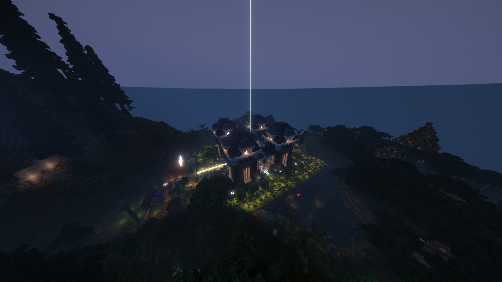

# 🪶 История сервера


История сервера началась еще до начала 1 сезона, но об этом будет рассказано в отдельной ветке



Некоторые даты и события могут быть не точными. Если вы помните какой то момент сервера или есть точная дата события и его нет в этом вики пишите [сюда](https://discord.gg/brjWXMMbpd)


## 1 Сезон

Официальная дата открытия 1 сезона произошла `01.08.2022`. Тогда на сервер зашли многие игроки с тестового сервера на Aternos.

Сервер был с кастомной генерацией и некоторым игрокам это не зашло, поскольку думали, что будет как обычно, и из-за этого многие ушли сразу после начала.

Игроки разбрелись кто куда и начали строить свои базы, были так же моменты гриферства, которые были исправлены администрацией.

В середине сезона был построен спавн, а так же рядом с ним небольшой рынок. В этот же момент был создан официальный дискорд сервер.

<figure><figcaption>
Спавн и рынок 1 сезона
</figcaption></figure>

Почти перед завершением сезона был модернизирован рынок и произошел инцидент с игроком `deexd`, которого загриферили игроки `Memniy_unitaz` и `Yarik328`. В наказание, база этих игроков была взорвана основателем сервера `MvtrIIIX`.

Конец сезона был фееричным, т.к. `MvtrIIIX` взорвал спавн кучей динамита, но главный тех. админ и сооснователь сервера `GideonWhite1029` восстановил спавн до изначального состояния, чтобы завершить сезон.&#x20;

1 сезон завершился `31.08.22`

## 2 сезон

2 сезон начался спустя месяц после окончания 1 сезона. Данный сезон не был запланирован и считался тестовым. Была введена система донатов для материальной поддержки сервера и блоки привата. На этот раз спавн находился в отдельном мире, а основной мир в другом. На этот раз мир был обычным и не планировалось использовать плагин на кастомную генерацию.&#x20;

Этот сезон стал спонсироваться музыкальной бандой `Pury World`. Ссылка на их [телеграмм группу](https://t.me/puryyvm).

Примерно в середине сезона был открыт доступ к энду и в этот же момент был добавлен плагин на кастомные пластинки, которые стали главной фишкой этого сервера.

<figure><figcaption>
База Pury World
</figcaption></figure>

Перед концом сезона произошел инцидент в технической части сервера. При попытке установить плагин на кастомную генерацию была случайно перезаписана основная карта сервера и из-за этого она стала не пригодна для загрузки. После этого, была создана новая карта, т. к. оригинал карты не был сохранен изначально.

Конец сезона оказался печальным т.к. этот инцидент повлиял на многих игроков сервера. Был создан отдельный мир с галереей в котором были запечателны яркие моменты сервера.

2 сезон закончился в конце октября 2022 года.

## 3 сезон

Этот сезон начался с целью продвижения сервера по популярности, а так же был создан с целью встречи нового года. Была группа в ВК с целью расширить охват аудитории.

Основной мир снова стал с кастомной генерацией, но на этот раз были готовы к непредвиденным обстоятельствам.

В начале января на сервер зашли люди из `Cresta La Cultura`. Им очень понравилось играть на сервере и даже они построили свою базу.&#x20;

Тогда же был проведен крупный ивент посвящённый фильму `Бегущий в Лабиринте`. Тогда фактически, победили Pury, но было принято решение о единой победе по некоторым причинам.&#x20;

Как и 2 сезон, конец 3 сезона оказался... пустым. Никто не пришел на закрытие 3 сезона, так как все были заняты своими делами. Было всего 2 игрока - `GideonWhite1029` и `Memniy_unitaz`. Сезон завершился `14.01.23`
